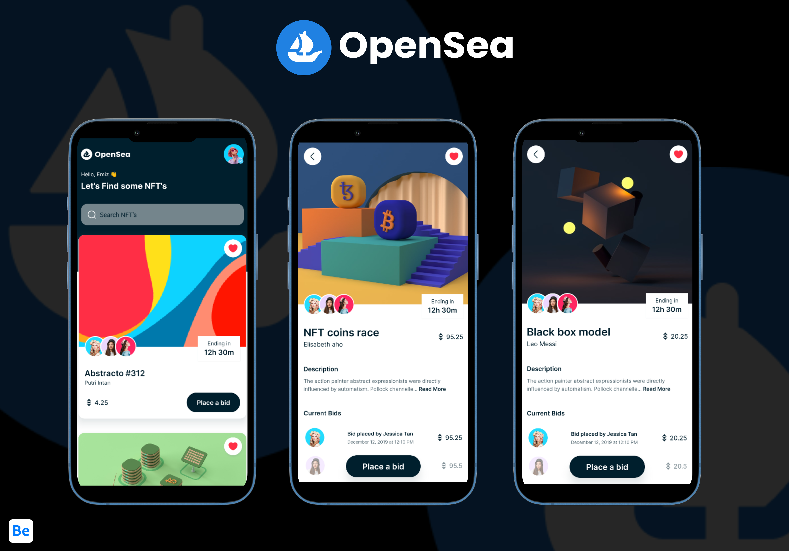

# NFT Marketplace (Frontend)

## Table of Contents

- [Introduction](#introduction)
- [Build Process](#build-process)
- [Tech Stack](#tech-stack)

 

## Introduction

This build was blog app inspired by opensea NFT Marketplace. The frontend of the application was build using React Native.

The design was inspired by [behance](https://www.behance.net/gallery/133383073/ProNef-Mobile-Market-NFT-?tracking_source=search_projects%7Cpronef)

## Build Process

- Clone or download the repo
- Install dependencies using `npm install` or `yarn`

## Tech Stack

    

## Project Goals & Outcomes

✔️ Learning Expo Cli  
✔️ Learning React Native
